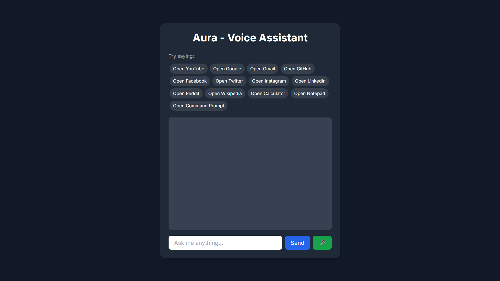

<p align="center">
	
</p>

# Aura - AI Voice Assistant

<p align="center">
	
	
	
</p>

<h2 align="center">Your Personal AI-Powered Voice Assistant</h2>

Aura is a modern, web-based AI voice assistant built with Flask and Google Gemini API. It can answer your questions, open popular websites and apps, and even respond to your voice—all in a beautiful, responsive interface.

---

## ✨ Features

- **Conversational AI**: Powered by Google Gemini for smart, contextual answers
- **Voice Input & Output**: Speak to Aura and hear responses back
- **Quick Commands**: Instantly open YouTube, Google, Gmail, Notepad, Calculator, and more
- **Modern UI**: Responsive, clean design with Tailwind CSS
- **Easy Setup**: Simple to run locally with minimal dependencies

---

## 🚀 Getting Started

### 1. Clone the Repository
```bash
git clone https://github.com/asimshaikh0125/Aura_Ai.git
cd Aura_Ai
```

### 2. Install Dependencies
Make sure you have Python 3.10+ installed.
```bash
pip install -r requirements.txt
```

### 3. Run the App
```bash
python app.py
```
Visit [http://127.0.0.1:5000](http://127.0.0.1:5000) in your browser.

---

## 🛠️ Tech Stack

- **Backend:** Flask, Python
- **Frontend:** HTML, Tailwind CSS, JavaScript (SpeechRecognition, SpeechSynthesis)
- **AI:** Google Gemini API

---

## ⚡ Example Commands

> "Open YouTube"
> 
> "Open calculator"
> 
> "Who is the president of the USA?"
> 
> "Open GitHub"

---

## 📁 Project Structure

```
├── app.py              # Flask backend
├── requirements.txt    # Python dependencies
├── templates/
│   └── index.html      # Main UI
└── readme.md           # Project info
```

---

## 🙏 Acknowledgements

- [Flask](https://flask.palletsprojects.com/)
- [Tailwind CSS](https://tailwindcss.com/)
- [Google Gemini API](https://ai.google.dev/)

---

## 📜 License

This project is licensed under the MIT License.
